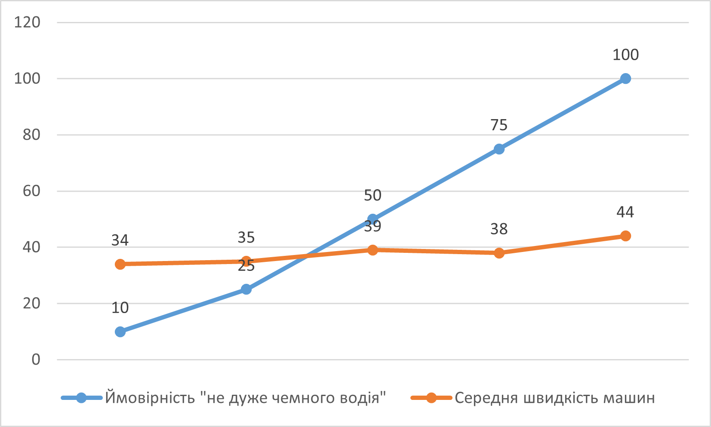

## Комп'ютерні системи імітаційного моделювання
## СПм-22-6, **Афанасьєва Анна Миколаївна**
### Лабораторна робота №**1**. Опис імітаційних моделей та проведення обчислювальних експериментів

 

### Варіант 1, модель у середовищі NetLogo Traffic Grid:
[Traffic Grid](http://www.netlogoweb.org/launch#http://www.netlogoweb.org/assets/modelslib/Sample%20Models/Social%20Science/Traffic%20Grid.nlogo)
Додати жовтий сигнал світлофорів. Додати вірогідність початку руху водіями не тільки на зелений, але і на жовтий сигнал світлофора.

 

## Внесені зміни у вихідну логіку моделі, за варіантом:
### Додати жовтий сигнал світлофорів:
У оригінальній моделі є змінна green-light-up?, що може приймати значення **Так** або **Ні**, тобто **зелений** або **червоний**. Для додання жовтого кольору цю змінну було змінено на:
<pre>
light-color
</pre>
Після чого змінила процедуру **set-signal-colors**, додавши логіку зміни жовтого кольору:
<pre>
to set-signal-colors  ;; intersection (patch) procedure
  ifelse power?
  [ 
    if light-color = 1
     [
      ask patch-at -1 0 [ set pcolor yellow ]
      ask patch-at 0 1 [ set pcolor red ]
     ]
    
    if light-color = 2
    [
      ask patch-at -1 0 [ set pcolor green ]
      ask patch-at 0 1 [ set pcolor yellow ]
    ]
    if light-color = 3
    [
      ask patch-at -1 0 [ set pcolor red ]
      ask patch-at 0 1 [ set pcolor green ]
    ]
  ]
  
  [
    ask patch-at -1 0 [ set pcolor white ]
    ask patch-at 0 1 [ set pcolor white ]
  ]
end
</pre>

Та відповідно було змінено **set-signals** для логіки появи жовтого кольору:
<pre>
to set-signals
  ask intersections with [auto? and phase = floor ((my-phase * ticks-per-cycle) / 100)]
  [
    ifelse light-color = 3
    [set light-color 1]
    [set light-color light-color + 1]
    set-signal-colors
  ]
end
</pre>

Ще не було створено реакцію водіїв на жовтий колір, тож симуляція під час роботи виглядає так:

Наступне завдання:
### Додати вірогідність початку руху водіями не тільки на зелений, але і на жовтий сигнал світлофора:
Для цього було об'явлено нову змінну "не дуже чемного водія":
<pre>
globals
  [...
  yellow-driver
  ...]
</pre>
та надано їй значення в 50 %:

<pre>
to setup-globals
...
  set yellow-driver 50
...
</pre>

Після чого змінила процедуру **set-car-speed** для використання створеної змінної:
<pre>
to set-car-speed  ;; turtle procedure
  ifelse pcolor = red 
  [ set speed 0 ]
  [
    ifelse pcolor = yellow and yellow-driver < random 100 [set speed 0] [
    ifelse up-car?
    [ set-speed 0 -1 ]
    [ set-speed 1 0 ]
    ]
  ]
end
</pre>
Після чого симуляція стала виглядати наступним чином:

Як можна побачити на скриншоті - деякі водії стоять перед жовтим кольором, а деякі проїхали.

## Внесені зміни у вихідну логіку моделі, на власний розсуд:
### Надано користувачу можливість зміни шансу "не дуже чемного водія":
Для цього було видалено глобальну змінну та додано новий важіль **yellow-driver**:

### Змінено кольор водія, що їде на високій шивдкості:
<pre>
to set-car-color  ;; turtle procedure
  ifelse speed < (speed-limit / 2)
  [ set color blue ]
  [ set color red ]
end
</pre>

Після усіх змін модель під час симуляції виглядає наступним чином:

 

## Обчислювальні експерименти
### 1. Вплив ймовірності проїхати жовтий на середню швидкість автомобілів
Досліджується залежність середньої швидкості машин, протягом певної кількості тактів (200) від ймовірності "не дуже чемного водія".
Експерименти проводяться при таких керуючих параметрах:
- **grid-size-x** - 5
- **grid-size-y** - 5
- **num-cars** - 100
- **power?** - Так.
- **ticks-per-cycle** - 20
- **speed-limit** - 1
- **current-auto?** - Так.
- **current-phase** - 0

<table>
<thead>
<tr><th>Ймовірність</th><th>Середня швидкість</th></tr>
</thead>
<tbody>
<tr><td>10</td><td>0,34</td></tr>
<tr><td>25</td><td>0,35</td></tr>
<tr><td>50</td><td>0,39</td></tr>
<tr><td>75</td><td>0,38</td></tr>
<tr><td>100</td><td>0,44</td></tr>
</tbody>
</table>

Як можна побачити з графіку - середня швидкість автоммобілів зростає при підвищенні шансу "не дуже чемного водія". Але дивлячись очима на саму симуляцію можливо було помітити дуже велику кількість "потенційних аварій".
